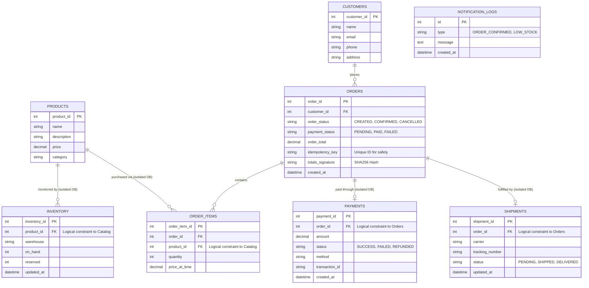

# Entity-Relationship Diagram (ERD)

This document visualizes the exact database structures implemented in our microservice architecture. 

It highlights the **Database-per-Service** pattern. Notice that while logical foreign keys (like `product_id` and `order_id`) connect the data, they are separated into isolated physical databases (e.g., `catalog_db` vs `order_db`), satisfying the microservices constraint.

