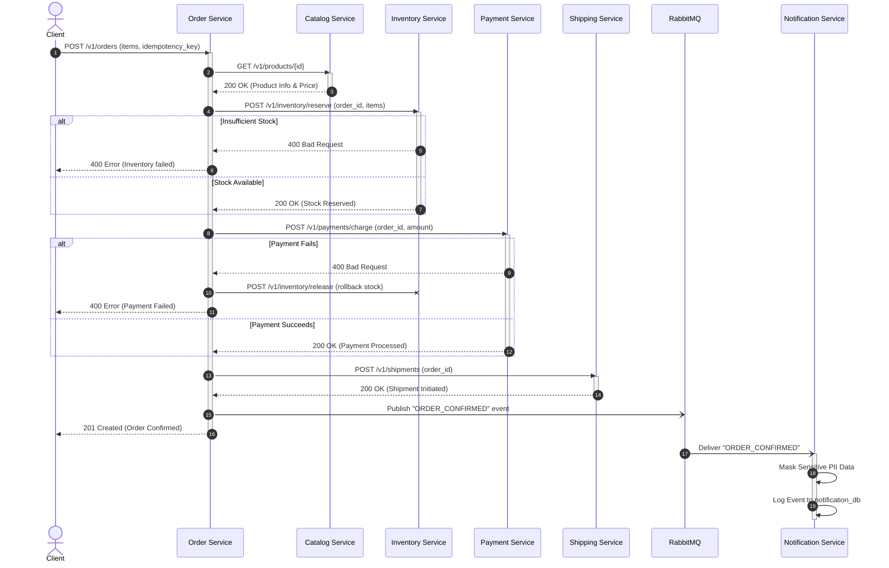

# Service Boundary & Workflow Sequence Diagram

This sequence diagram proves that we have implemented a **true microservices workflow** rather than just disconnected CRUD endpoints. 

It demonstrates the Orchestrator pattern where the Order Service enforces strict business rules (e.g., verifying product exists, reserving stock, charging the payment before shipping) across multiple isolated boundaries.

